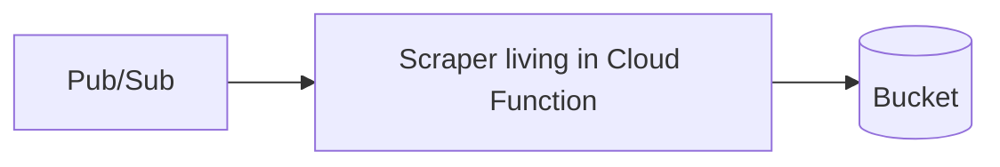

## Scrape a website using a google cloud function and store HTML to a blob

This is the configuration to follow to extract data at a given time set in 
your Pub/Sub cron

Refs:
https://weautomate.org/articles/running-scrapy-spider-cloud-function/

